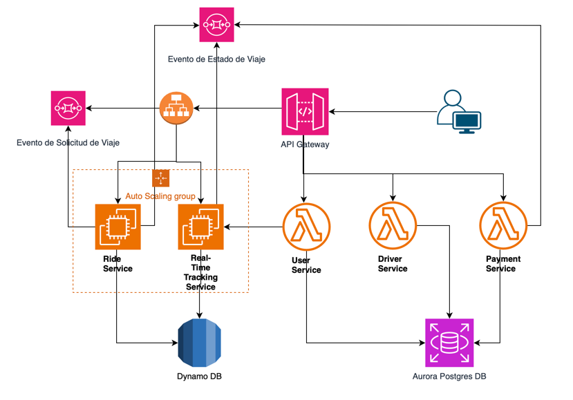
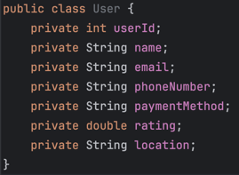
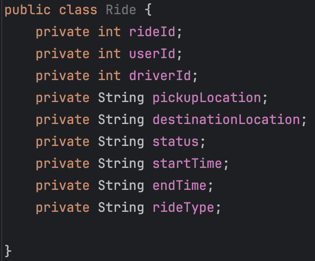
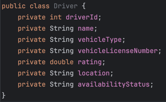
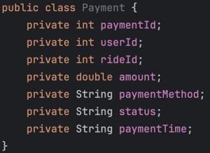

# Design a Microservice Architecture for a Ride-Sharing Platform (e.g., Uber):

## Task Overview:

+ Analyze the problem to identify and model key resources such as rides, drivers, users, and payments. Utilize class diagrams or code to illustrate the domain's objects.
+ Identify related resources and supporting methods, including ride requests, driver management, and real-time tracking.
+ Define the representation of resources to standardize interactions across services.
+ Create model URIs for each resource to establish clear and organized endpoints.
+ Assign suitable HTTP methods to each resource in line with RESTful design principles.
+ Design a microservice architecture that ensures scalability, real-time communication, and modular development.
+ Implement a simple prototype using cloud-based services, including API Gateway, Lambda functions, and EC2.


## Development Steps:

1. Identify the Resources – Object Modeling: Create models for key objects such as rides, users, drivers, and payments through class diagrams or code structures.
2. Create Model URIs: Develop concise and consistent URIs representing each resource, ensuring logical grouping.
3. Determine Resource Representations: Define how resources will be represented (e.g., JSON) in responses.
4. Assign HTTP Methods: Map HTTP methods (e.g., GET for ride details, POST for new ride requests, PUT for updating driver status) to appropriate resource operations.


## Proposed Ride-Sharing Platform Architecture



## Resource identification (user, driver, ride, payment)

<div style="display: flex; gap: 20px;">
  
  
</div>

<div style="display: flex; gap: 20px; margin-top: 10px;">
  
  
</div>

## Definition of operations required on the platform on the resources (user, driver, ride, payment)

* **Ride Requests (Solicitud de viajes):**
  1. `createRideRequest` (Crea una nueva solicitud de viaje)
     * **Endpoint:** `POST /rides`
     * **Input:**
     ```json
        {
          "userId": 67890,
          "pickupLocation": "123 Main St",
          "destinationLocation": "456 Elm St",
          "rideType": "economy"
        }
     ```

     * **Output**
      ```json
        {
          "userId": 67890,
          "pickupLocation": "123 Main St",
          "destinationLocation": "456 Elm St",
          "rideType": "economy"
        }
      ```

  2. `cancelRideRequest:` (Permite al usuario cancelar una solicitud de viaje)
     * **Endpoint:** `PUT /rides/{rideId}/cancel`
     * **Input:**
        ```json
         {
          "rideId": 12345,
          "userId": 67890
         }
        ```

     * **Output**
         ```json
         {
          "rideId": 12345,
          "status": "canceled",
          "message": "Ride request has been successfully canceled."
         }
         ```  

  3. `getRide:` (Obtiene el detalle del viaje)
     * **Endpoint:** `GET /rides/{rideId}`
     * **Output**
       ```json
       {
        "rideId": 12345,
        "status": "in_progress",
        "driverLocation": "789 Pine St"
       }
       ```

  4. `rateDriver` (Permite que el usuario califique al conductor después del viaje)
     * **Endpoint:** `PUT /rides/{rideId}/rateDriver`
     * **Input:**
       ```json
       {
        "userId": 67890,
        "driverId": 54321,
        "rating": 4.5
       }
       ```
     * **Output**
       ```json
       {
        "rideId": 12345,
        "driverId": 54321,
        "newDriverRating": 4.7,
        "message": "Driver has been successfully rated."
       }
       ```  

* **Driver Management (Gestión de conductores):**
  1. `registerDriver` (Registra un nuevo conductor en la plataforma)
    * **Endpoint:** `POST /drivers`
    * **Input:**
      ```json
      {
        "name": "John Doe",
        "vehicleType": "SUV",
        "vehicleLicenseNumber": "ABC123",
        "location": "123 Main St"
      }
      ```
    * **Output:**
      ```json
      {
        "driverId": 54321,
        "name": "John Doe",
        "vehicleType": "SUV",
        "vehicleLicenseNumber": "ABC123",
        "rating": 5.0,
        "location": "123 Main St",
        "availabilityStatus": "available"
      }
      ```

  2. `updateDriverStatus` (Actualiza el estado del conductor)
    * **Endpoint:** `PATCH /drivers/{driverId}/status`
    * **Input:**
      ```json
      {
        "availabilityStatus": "busy"
      }
      ```
    * **Output:**
      ```json
      {
        "driverId": 54321,
        "availabilityStatus": "busy",
        "message": "Driver status updated successfully."
      }
      ```

  3. `getDriverInfo` (Obtener detalles de un conductor específico)
    * **Endpoint:** `GET /drivers/{driverId}`
    * **Output:**
      ```json
      {
        "driverId": 54321,
        "name": "John Doe",
        "vehicleType": "SUV",
        "vehicleLicenseNumber": "ABC123",
        "rating": 4.7,
        "location": "123 Main St",
        "availabilityStatus": "available"
      }
      ```

* **Real-Time Tracking (Seguimiento en tiempo real):**
  1. `trackRide` (Permite ver la ubicación en tiempo real del conductor durante un viaje)
    * **Endpoint:** `GET /tracking/rides/{rideId}`
    * **Output:**
      ```json
      {
        "rideId": 12345,
        "driverId": 54321,
        "driverLocation": "789 Pine St",
        "status": "in_progress"
      }
      ```

  2. `updateDriverLocation` (Actualiza la ubicación del conductor mientras está disponible o en un viaje)
    * **Endpoint:** `PATCH /tracking/drivers/{driverId}/location`
    * **Input:**
      ```json
      {
        "location": "101 Maple Ave"
      }
      ```
    * **Output:**
      ```json
      {
        "driverId": 54321,
        "location": "101 Maple Ave",
        "message": "Driver location updated successfully."
      }
      ```

* **User Management (Gestión de usuarios):**
  1. `registerUser` (Registra un nuevo usuario en la plataforma)
    * **Endpoint:** `POST /users`
    * **Input:**
      ```json
      {
        "name": "Alice Smith",
        "email": "alice@example.com",
        "phoneNumber": "+123456789",
        "paymentMethod": "credit_card"
      }
      ```
    * **Output:**
      ```json
      {
        "userId": 67890,
        "name": "Alice Smith",
        "email": "alice@example.com",
        "phoneNumber": "+123456789",
        "paymentMethod": "credit_card",
        "rating": 5.0,
        "location": null
      }
      ```

  2. `listRides` (Listar historial de viajes)
    * **Endpoint:** `GET /users/{userId}/rides`
    * **Output:**
      ```json
      {
        "userId": 67890,
        "rides": [
          {
            "rideId": 12345,
            "pickupLocation": "123 Main St",
            "destinationLocation": "456 Elm St",
            "status": "completed",
            "startTime": "2024-11-09T10:30:00",
            "endTime": "2024-11-09T11:00:00",
            "rideType": "economy",
            "driverId": 54321
          },
          {
            "rideId": 12346,
            "pickupLocation": "789 Pine St",
            "destinationLocation": "101 Maple Ave",
            "status": "completed",
            "startTime": "2024-11-08T14:00:00",
            "endTime": "2024-11-08T14:30:00",
            "rideType": "premium",
            "driverId": 54322
          }
        ]
      }
      ```

  3. `updatePaymentMethod` (Agregar o Actualizar Método de Pago)
    * **Endpoint:** `PUT /users/{userId}/payment-method`
    * **Input:**
      ```json
      {
        "paymentMethod": "paypal"
      }
      ```
    * **Output:**
      ```json
      {
        "userId": 67890,
        "paymentMethod": "paypal",
        "message": "Payment method updated successfully."
      }
      ```